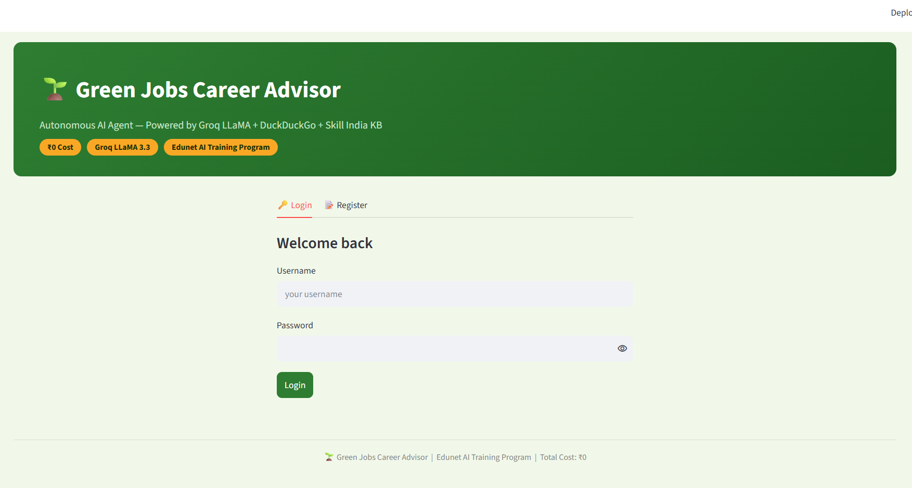
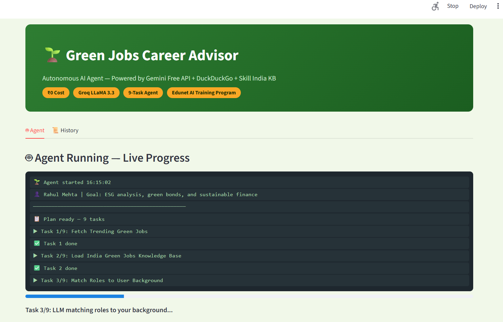
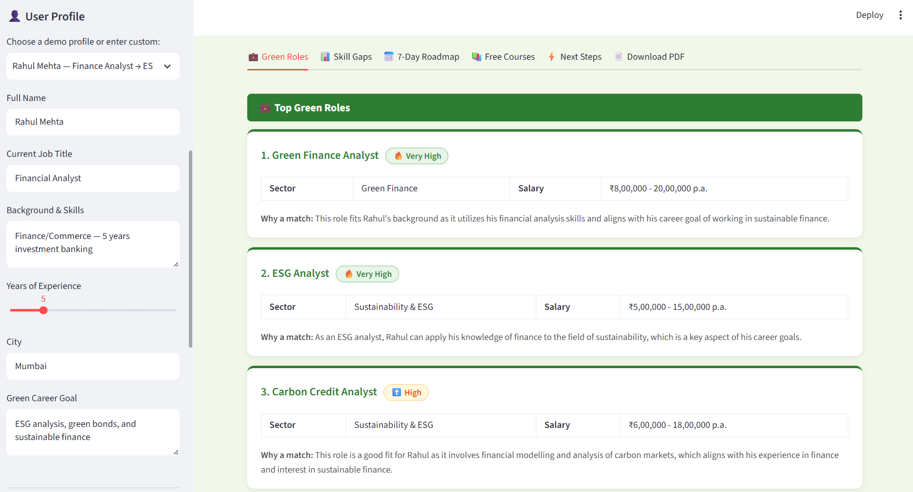
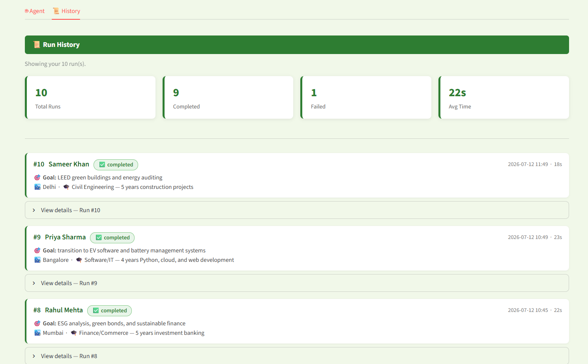
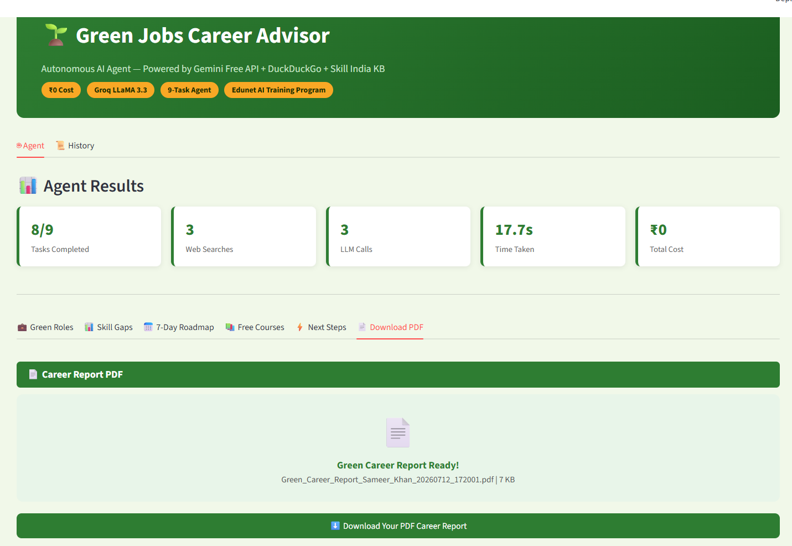

# 🌱 Green Jobs Career Advisor Agent

> An autonomous AI agent that helps professionals transition into green careers — built to industry standards.

## 📸 Screenshots

### Login Page


### Agent Running — Live Progress


### Green Roles Matched to Your Profile


### Run History


### Generated PDF Report


---

## 🎯 What it does

Given a user's professional background and career goal, the agent autonomously executes 9 tasks:

| Task | Tool | What Happens |
|------|------|-------------|
| 1 | 🔍 Web Search | Fetches trending green jobs in India (live) |
| 2 | 📚 Knowledge Base | Loads curated Skill India green roles data |
| 3 | 🧠 Groq LLaMA | Matches top 4 roles to the user's background |
| 4 | 🧠 Groq LLaMA | Identifies personalised skill gaps |
| 5 | 🔍 Web Search | Finds free green courses available now |
| 6 | 📚 Knowledge Base | Loads free learning platforms |
| 7 | 🧠 Groq LLaMA | Builds a personalised 7-day roadmap |
| 8 | 🔍 Web Search | Searches current salary trends in India |
| 9 | 📄 PDF Generator | Creates a complete career transition report |

**Total cost: ₹0** — 100% free API stack.

---

## 🏗️ Architecture

```
User Profile (name, background, career goal)
          ↓
      Planner → 9-task plan created before execution
          ↓
      Executor Loop (autonomous)
      ├── WebSearchTool      (DuckDuckGo — live data)
      ├── KnowledgeBaseTool  (Skill India JSON — structured data)
      ├── Groq LLaMA 3.3     (reasoning — role match, gaps, roadmap)
      └── ReportTool         (fpdf2 — professional PDF)
          ↓
      PDF Career Report delivered
      Run saved to SQLite history database
```

### All 6 Agent Components

| Component | Implementation |
|-----------|---------------|
| 🎯 Goal | Career transition to green jobs |
| 🧠 Reasoning | Groq LLaMA 3.3 70B — 3 intelligent LLM calls |
| 📋 Planning | 9-task plan created before execution begins |
| 🔧 Tools | DuckDuckGo × 3 + Knowledge Base × 2 + PDF Generator |
| 💾 Memory | Results stored and reused across all 9 tasks |
| ⚡ Action | Personalised PDF career report delivered |

---

## 🏭 Industry Standards Applied

This project was upgraded from a demo notebook to production-grade code. Every decision is intentional:

| Practice | Implementation | Why |
|----------|---------------|-----|
| Dependency management | `pyproject.toml` + `uv` | Reproducible environments, faster installs |
| Secrets management | `.env` + `python-dotenv` | No hardcoded API keys ever reach Git |
| Authentication | bcrypt (work factor 12) | Industry-standard password hashing |
| Database | SQLite + `sqlite-utils 4.0` | Zero-infrastructure persistent storage |
| Logging | Python `logging` module | Console + file output, structured format |
| Code quality | `ruff` — 0 lint errors | Consistent style, catches bugs early |
| Testing | `pytest` — 25/25 passing | Smoke tests for DB, auth, and tools |
| Version control | Git + GitHub, clean history | `.gitattributes` for consistent line endings |

---

## 🛠️ Tech Stack

| Layer | Technology | Why Chosen |
|-------|-----------|-----------|
| LLM | Groq LLaMA 3.3 70B | Fast inference, generous free tier |
| Web search | DuckDuckGo (`ddgs`) | No API key needed, truly free |
| Knowledge base | Curated Skill India JSON | India-specific, instant, offline |
| PDF generation | `fpdf2` | Open source, no external services |
| Frontend | Streamlit | Fast UI for ML/AI apps |
| Database | SQLite + `sqlite-utils` | Zero setup, single file, perfect for this scale |
| Auth | `bcrypt` | Industry standard for password hashing |
| Package manager | `uv` | 10-100x faster than pip |

---

## ✨ Features

- **🔐 Login / Register** — secure bcrypt authentication, no agent access without login
- **🤖 Autonomous Agent** — 9-task plan executed without human intervention
- **📜 Run History** — every run saved; users see their own, admin sees all (RBAC)
- **📄 PDF Report** — professional multi-page career report with cover page
- **🌐 Live Data** — real-time web search for current job market data
- **📊 Knowledge Base** — 6 sectors, 15 roles, 8 free platforms (Skill India)
- **⚡ Fast LLM** — Groq runs LLaMA 3.3 70B faster than most hosted models

---

## 🚀 Quick Start

### Prerequisites
- Python 3.11+
- `uv` package manager
- Free Groq API key → [console.groq.com/keys](https://console.groq.com/keys)

### Installation

```bash
# 1. Clone the repo
git clone https://github.com/codewithleo1/Green-Job-Agent.git
cd "Green-Job-Agent/green_jobs_agent V3"

# 2. Install dependencies
pip install uv
uv sync

# 3. Set up environment
cp .env.example .env
# Open .env and add your GROQ_API_KEY
```

### Run the app

```bash
uv run streamlit run app.py
```

### Run tests

```bash
uv run pytest tests/ -v
```

---

## 📁 Project Structure

```
green_jobs_agent V3/
├── app.py                      ← Streamlit UI (login + agent + history)
├── agent/
│   ├── executor.py             ← Tool orchestration + Groq LLM calls
│   ├── planner.py              ← 9-task plan generator
│   └── green_career_agent.py  ← Main orchestrator (one-line runner)
├── tools/
│   ├── search_tool.py          ← DuckDuckGo web search
│   ├── knowledge_tool.py       ← Skill India knowledge base reader
│   └── report_tool.py          ← PDF report generator (fpdf2)
├── src/green_jobs/
│   ├── db.py                   ← SQLite: users, runs, run_logs tables
│   └── auth.py                 ← bcrypt register/login/session
├── tests/
│   ├── test_db.py              ← 9 database tests
│   ├── test_auth.py            ← 9 authentication tests
│   └── test_tools.py           ← 7 knowledge base tests
├── data/
│   └── green_jobs_india.json   ← 6 sectors, 15 roles, 8 platforms
├── pyproject.toml              ← Dependencies + tool config
├── .env.example                ← Environment variable template
├── .gitignore
├── .gitattributes
└── PROGRESS.md                 ← Full upgrade log + gotchas
```

---

## 📊 Knowledge Base

**Sectors (6):** Solar Energy, Electric Vehicles, Sustainability & ESG, Green Building, Wind Energy, Green Finance

**Job Roles (15):** Solar PV Technician, Solar Energy Engineer, EV Battery Engineer, EV Software Engineer, ESG Analyst, Carbon Credit Analyst, Sustainability Manager, Green Building Consultant, Energy Auditor, Wind Turbine Technician, Wind Resource Analyst, Green Finance Analyst, and more.

**Free Platforms (8):** NPTEL, Coursera (Audit), Skill India/PMKVY, UNEP Finance Initiative, edX (Audit), YouTube MNRE, GRI Academy, iGOT Karmayogi

---

## 👤 Demo Profiles

```python
# Software Engineer → EV
{"name": "Priya Sharma", "background": "Software/IT — 4 years Python, cloud",
 "career_goal": "EV software and battery management systems"}

# Finance → ESG
{"name": "Rahul Mehta", "background": "Finance/Commerce — 5 years banking",
 "career_goal": "ESG analysis, green bonds, and sustainable finance"}

# Mechanical → Wind/EV
{"name": "Anita Patel", "background": "Mechanical Engineering — 6 years manufacturing",
 "career_goal": "wind turbine maintenance and EV powertrain systems"}

# Civil → Green Buildings
{"name": "Sameer Khan", "background": "Civil Engineering — 5 years construction",
 "career_goal": "LEED green buildings and energy auditing"}
```

---

## 💰 Cost Breakdown

| Tool | Provider | Cost |
|------|----------|------|
| Groq LLaMA 3.3 70B | Groq | Free (generous daily limit) |
| Web Search | DuckDuckGo | Free (no API key) |
| Knowledge Base | Local JSON | Free |
| PDF Generation | fpdf2 | Free (open source) |
| Database | SQLite | Free (built into Python) |
| **TOTAL** | | **₹0** |

---

## 🧪 Tests

```
tests/test_auth.py   — 9 tests  (register, login, validation, admin, bcrypt)
tests/test_db.py     — 9 tests  (schema, users, runs, logs, stats)
tests/test_tools.py  — 7 tests  (sectors, roles, platforms, KB queries)

Total: 25/25 passing ✅
```

All tests use isolated `tmp_path` fixtures — they never touch the production database.

---

## 🔑 Environment Variables

Copy `.env.example` to `.env` and fill in your values:

```env
GROQ_API_KEY=your_groq_api_key_here
DB_PATH=green_jobs.db
SECRET_KEY=change-this-to-a-random-string
ADMIN_USERNAME=admin
ADMIN_PASSWORD=your_admin_password
APP_TITLE=Green Jobs Career Advisor
ORG_NAME=Your Organization Name
```

---

## 📖 What I Learned

- How to architect an autonomous AI agent (Goal → Plan → Loop → Action)
- Industry-standard Python project setup with `uv` and `pyproject.toml`
- Why secrets management matters — GitHub's scanner caught my hardcoded key
- SQLite database design for multi-user applications with role-based access
- bcrypt password hashing and safe authentication patterns
- Writing meaningful smoke tests with `pytest` fixtures
- Using `git filter-repo` to scrub secrets from git history
- How `ruff` enforces code quality automatically

---

## 🙏 Acknowledgements

- **Edunet AI Training Program** — for the original project concept
- **Groq** — for the blazing fast free LLM inference
- **NITI Aayog / ILO** — for green jobs data that informed the knowledge base
- **Skill India / PMKVY** — for the free learning platform data

---

## 📄 License

MIT License — see [LICENSE](LICENSE) for details.

---

<div align="center">
  <b>Built with ❤️ for a greener future 🌱</b><br/>
  <a href="https://github.com/codewithleo1">@codewithleo1</a>
</div>
